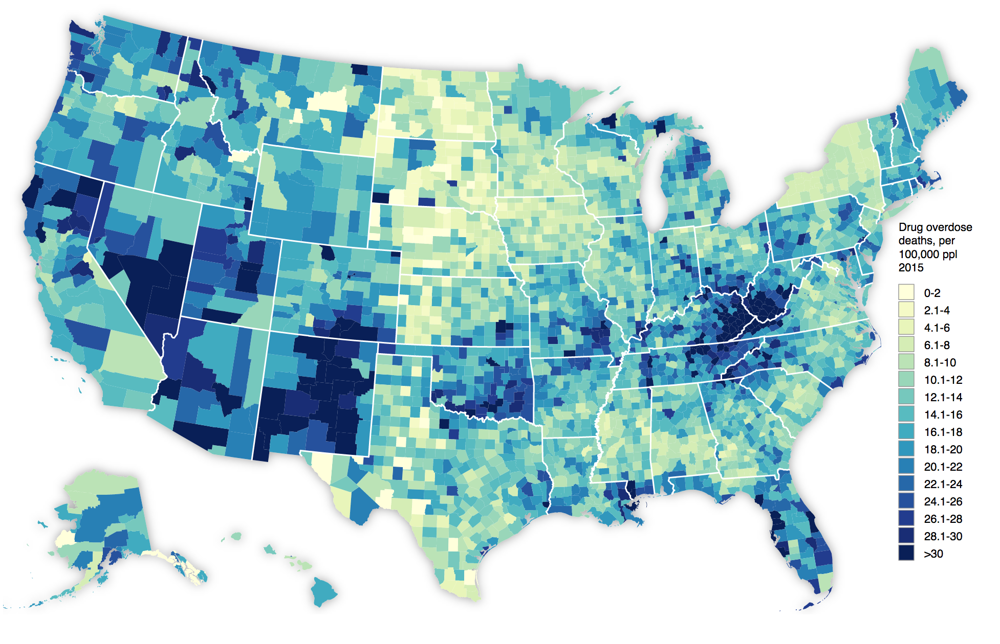

# 11-geospatial-viz-with-d3
Creating a [choropleth map](http://axismaps.github.io/thematic-cartography/articles/choropleth.html), a type of _Thematic Map_, of 2015 drug overdoses using d3-geo and TopoJSON. Apologies in advance for the grim topic 😞

_Aside: in the context of geospatial visualization, the word "map" refers to a geographic map, as opposed to a non-geographic mapping of data such as a bar chart, scatterplot, etc._

  Data from NCHS: https://www.cdc.gov/nchs/data-visualization/drug-poisoning-mortality/index.htm

In this class we'll talk about working with geospatial data, or data that has a location component and/or geometry data type. A location component could be described as a:

  - place name, (e.g. "Jacobs Hall" or "University of California Berkeley")
  - street level address, (e.g. "2530 Ridge Rd, Berkeley, CA 94709")
  - pair of latitude and longitude coordinates (e.g. [37.8760221, -122.2588018]), or coordinates in [some other spatial reference system](http://epsg.io/?q=California)
  - country name ("United States")
  - state name ("California")
  - county name ("Alameda")
  - postal code (94709)

A geometry type could be described as a:

  - point
  - line
  - polygon
  - multi-point
  - multi-line
  - multi-polygon

Geospatial data types can generally be categorized as either Vector or Raster, and may be found in the wild in a variety of formats such as:

- Shapefile
- GeoJSON
- TopoJSON
- CSV
- KML
- GeoTIFF

In class we'll take a look at the free and open source software [QGIS](http://www.qgis.org/en/site/), a desktop [GIS](https://en.wikipedia.org/wiki/Geographic_information_system) that allows for viewing and manipulating geospatial data. **_You should have QGIS installed on your machine prior to class_**. When working with geospatial data it's very common to have to inspect the data visually, view it overlaid on top of a basemap, transform coordinate systems, convert it to a different data format, or perform some type of [geoprocessing](http://desktop.arcgis.com/en/arcmap/10.3/main/analyze/what-is-geoprocessing.htm). QGIS will allow for us to get our feet wet with some of these processes.

We'll also take a look at [**TopoJSON**](https://github.com/topojson/topojson), created by Mike Bostock, and the [**Mapshaper CLI**](https://github.com/mbloch/mapshaper) and [**Mapshaper Web based GUI**](http://mapshaper.org/) created by Matt Bloch for simplifying data with complex geometries.

## Resources
- [d3-geo](https://github.com/d3/d3-geo)
- [d3-geo-projection](https://github.com/d3/d3-geo-projection)
- [GeoJSON spec](https://macwright.org/2015/03/23/geojson-second-bite)
- [geojson.io](https://macwright.org/2013/07/26/geojsonio.html) Online tool for viewing and creating GeoJSON
- [TopoJSON client & CLI tools](https://github.com/topojson/topojson)
- [Mapshaper](https://github.com/mbloch/mapshaper)
- [EPSG.io](http://epsg.io/) for looking up geographic Coordinate Reference Systems

### Data Sources
- [Natural Earth](http://www.naturalearthdata.com/) is appropriate for making large to medium scale maps of the world, regions, and countries.
- [OpenStreetMap Metro Extracts](https://www.census.gov/geo/maps-data/data/cbf/cbf_counties.html) for when you need detailed reference data such as roads, high accuracy coastlines, etc.
- [U.S. Atlas](https://github.com/topojson/us-atlas) Pre-built TopoJSON data from the U.S. Census Bureau.
- [U.S. Census Bureau's Cartographic Boundary Shapefiles](https://www.census.gov/geo/maps-data/data/cbf/cbf_counties.html) for when you need an a state extract. For all of the U.S. it's easier to use D3's U.S. Atlas above.
